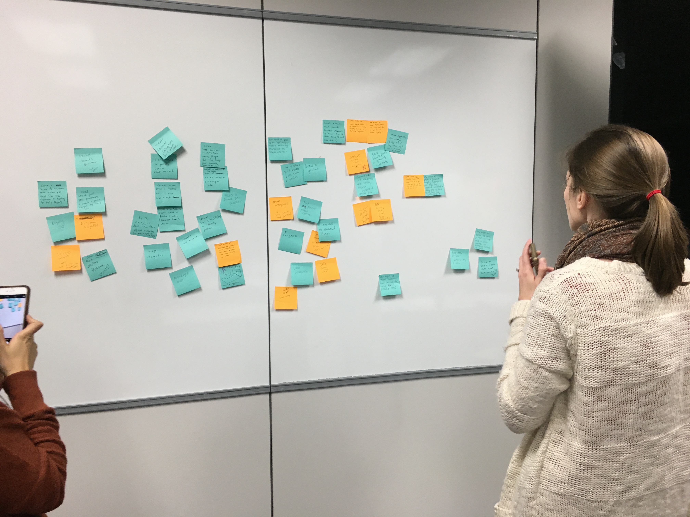
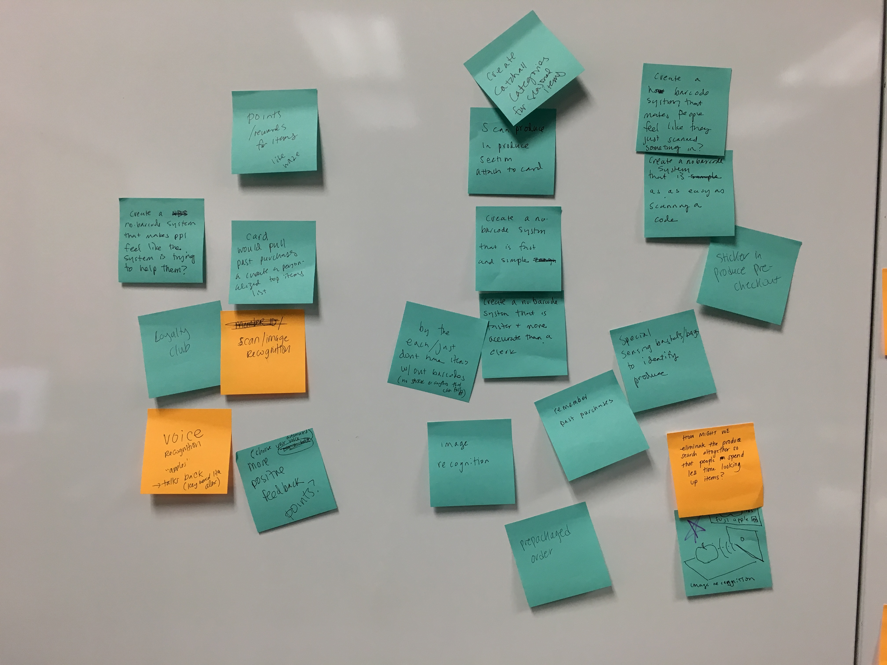
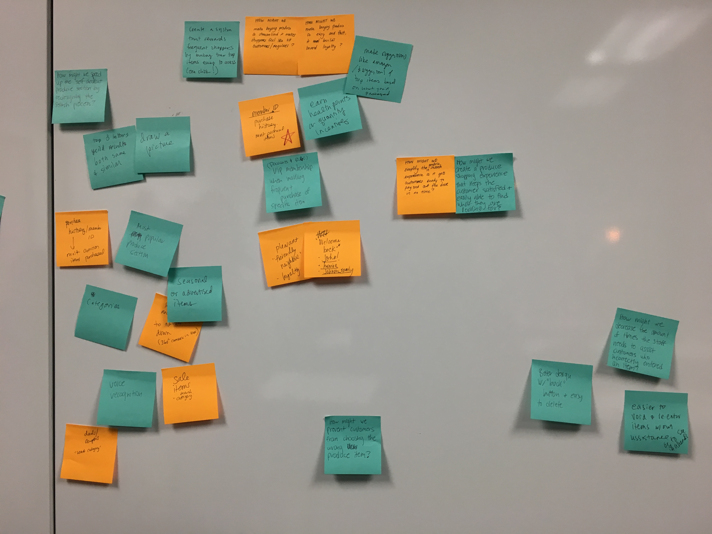
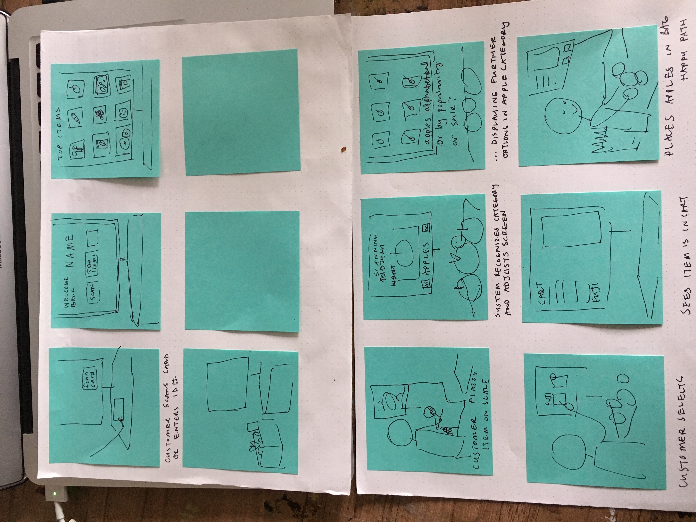

## Week 3 in Class

This week we worked on taking our user stories and generating some problem areas we could solve
then we made sticky notes of some the possible solutions to our problem

#### SOME OF OUR IDEAS
* using image recognition to identify what the customer is placing on the scale without the customer needing to do anything
  * the idea being that the image recognition would pull up a more specific menu for the user to select from -- like leafy greans or apples or bananas 
* starting the non-barcode screen with common items from the customer's loyalty account
* including some sort of reward or insentive program to make shopping feel more fun like waze
* include PLU numbers more prominently in the produce section
* have a start or intro screen that displays some frequently or recently purchased items

#### USER FLOW DIAGRAM

after we had brainstormed some ideas we created some sotryboards 