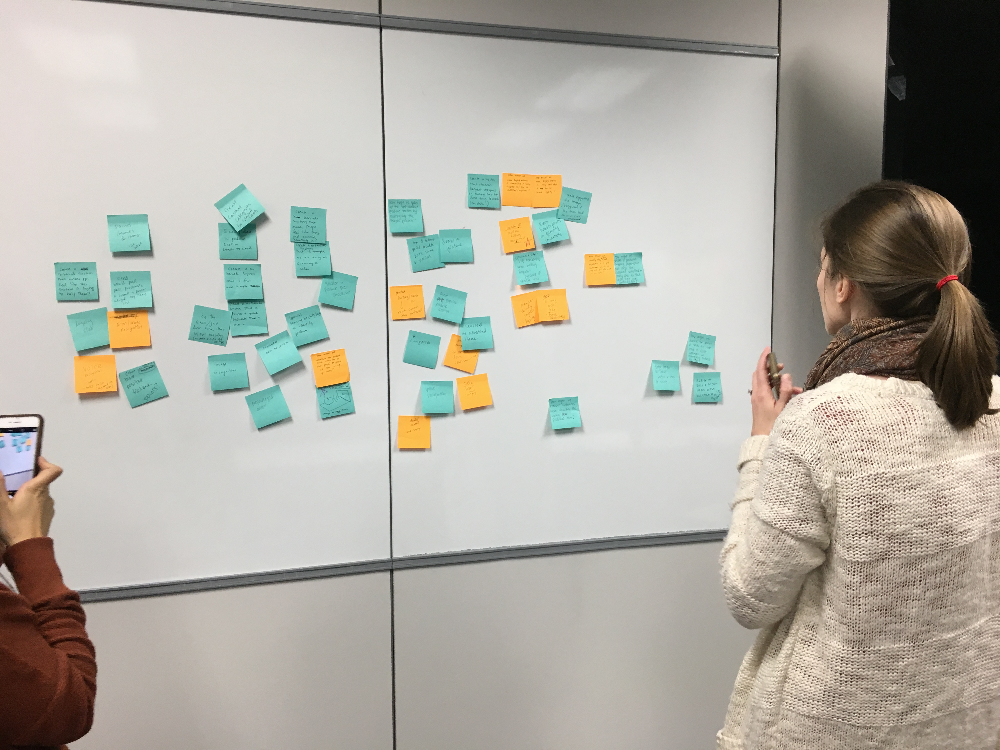
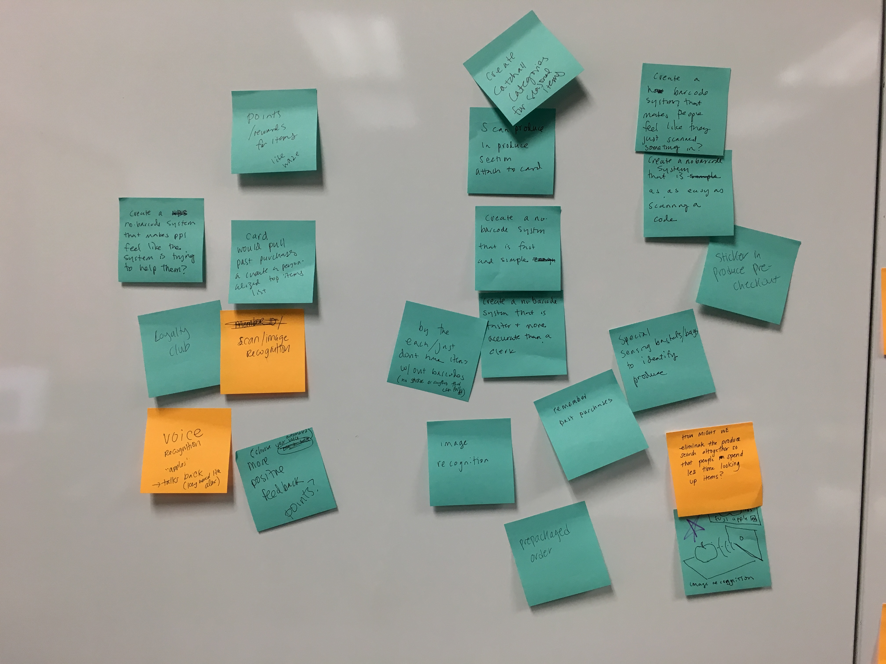
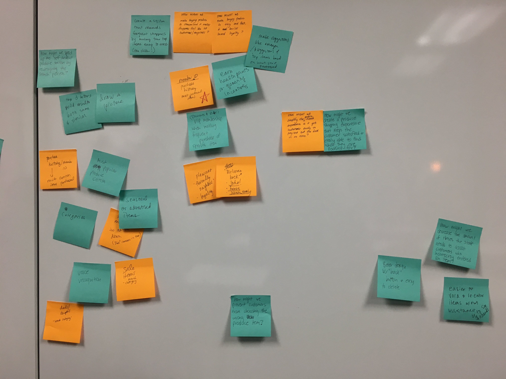
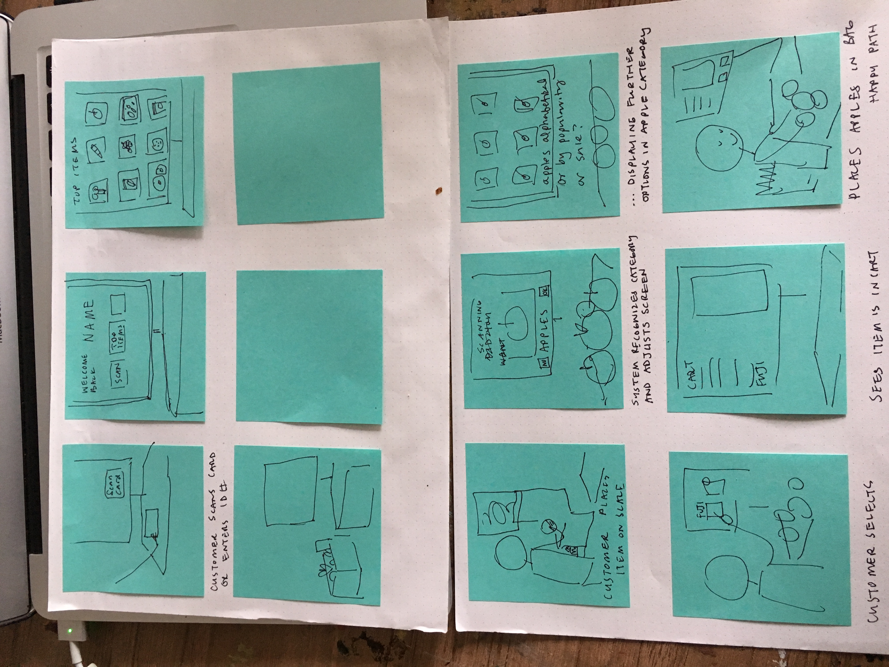

### Day 3
#### User Stories
* user stories should be based on real people/ actual interviews

#### Classmate ideas
* scanning for produce with codes
* bring bags y/n
* loyalty card y/n
* tagline or quote
* occupation/age/name?
* titles embodied personality /sticky names
* stories--almost like snap shots of a moment
* behaviors rather than demographics
  * keep details related to behavior
### Ideation Excersises:
#### Problem Statement
related to the problem you're trying to solve with your design ex: bagging is confusing and makes people feel anxious

what is the problem -- why is it a problem
* it is difficult to look up items without a barcode
* looking up items with out a barcode is confusing and makes people feel frustrated
* looking up items with out a barcode takes a long time and is often confusng -- people feel frustrated and may give up, leave things behind or worry they are being charged for the wrong item

* looking up produce with out a barcode takes a long time with many confusing points and ambiguities -- not knowing the name or not finding the item -- people feel frustrated and may give up or purposefully choose the wrong item to speed up the process.  Even commonly purchased items can be difficult to find with out a barcode

#### Insight Statements 
I noticed __________.  I think that means ________________.

* I noticed _______ with one item on the scale for a long time. I think that means they were having a hard time entering it in.
* I noticed _________ put an item in their bag with out paying for it after moving it around on the scale alot and clicking through screens, I think that means they were trying to enter it but couldn't figure out how.
* I noticed _____ enter in the wrong item after searching alphabetically and not finding their item.  
* I noticed ______ look at the screen and look around, then back at the screen.  I think they were confused
* I noticed ______ pick up an item set it on the scale and wait, click some screens, then do it again, look around, click some more and put the item in the bag.  the scale didn't check out but they waited it out.  I think they felt like they were spending too much time and wanted to be done

#### How Might We...
ex: Create a bagging experience that is sos inturitive it makes everyone feel like a grocery pro?

* create a produce or no barcode navigation system that makes people feel like the system is trying to help them?
* create a no-barcode system that is faster and more accurate than the check out clerk
* create a no-barcode system that rewards frequent shoppers by making commonly purchased items easy to access
* create a no-barcode navigation system that is simple enough to be easy to use for beginniners but extensive enough for people buying unique or seasonal items
* create a no-barcode system that makes it fast to find items without knowing the name or number, while also being specific enough to include all possible items
* create a no-barcode navigation system that is as easy as scanning a code 

#### Brainstorm solutions
We wrote some of the things we came up with in the "How Might We.." section on stickys and organized them on the white board... then we wrote possible solutions on sticky notes around some of the 'how might we' propositions.

_here we are looking at our notes_  

#### Story board solution

Once we'd come up with some proposed solutions we all returned to our seats to storyboard out some of/one of our proposed solutions-- what would that look like for the user? What is the first, second, third step etc

#### Sketches and wireframes
* visual representation of functional requirements 
* limited use of color and graphics 
* sample text or lorem ipsom
* they allow you to test a flow or process without the user getting caught up on details
* good to look unfinished that way testers focus on the steps

#### HOMEWORK DUE WEEK 4:
Homework is to create a wireframe of one of the solutions
My plan was to design the screens that the user would be seeing-- but now I'm thinking I need to design some of the experience as well, if we use the image recognition one-- how exactly will that work, at what point will the machine prompt with image recognition? will the screen get too cluttered?
* I've taken some photos of current self checkout screens

* TODO: use gatsby to create a page that just displays all the images in the UX_class folder-- and transforms them into thumbnails
